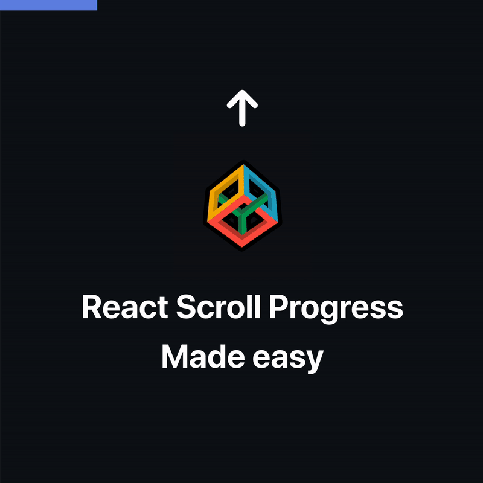

## React scroll progress made easy

<p align="center"></p>

### ProgressBar component

```jsx
function ProgressBar() {
  const percentScroll = useScroll();

  return (
    <div
      style={{
        width: percentScroll + "%",
        position: "fixed",
        backgroundColor: "red",
        height: "16px",
        zIndex: 10,
      }}
    />
  );
}
```

### Custom scroll hook

This hook adds an `event listener` that is triggered any time we scroll and calls a `scroll` function

```jsx
function useScroll() {
    const [percentageScrolled, setPercentageScrolled] = useState(0);

    useEffect(() => {
        const scroll = () => setPercentageScrolled(calculateScrollPercentage());

        document.addEventListener('scroll', scroll);

        return () => document.removeEventListener('scroll', scroll);
    }, []);

    return percentageScrolled;
}
```

### Calculate percentage scrolled

This function returns the percentage scrolled down

```jsx
function calculateScrollPercentage() {
    const scrollOffset = window.pageYOffset;
    const scrollPercentage = Math.floor(scrollOffset / totalPageHeight() * 100);

    return scrollPercentage;
}

function totalPageHeight() {
    const windowHeight = window.innerHeight;
    const docHeight = document.documentElement.scrollHeight;

    return docHeight - windowHeight;
}
```

